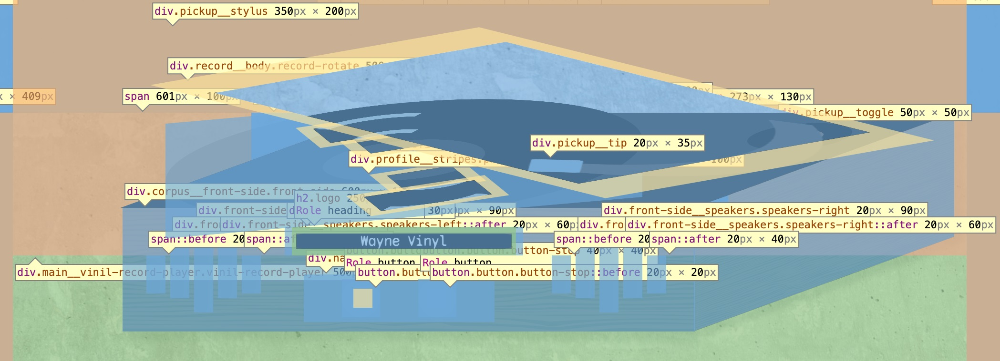
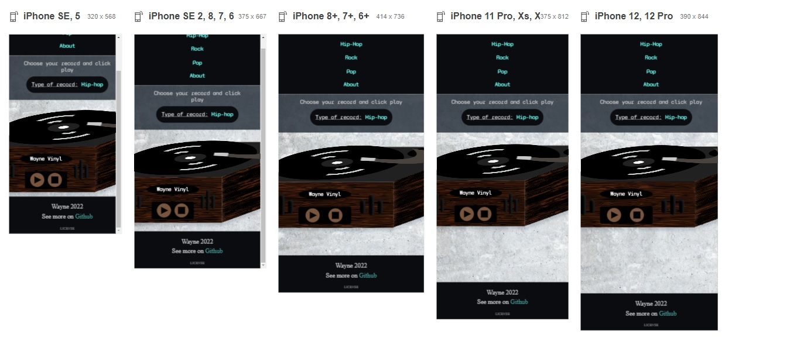
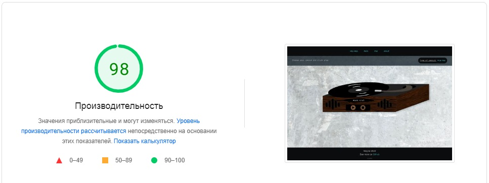
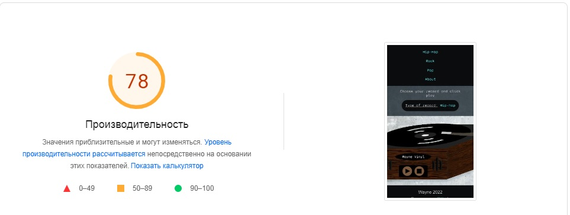

# Vinyl record player
## :open_file_folder: Проект: 
Виниловый проигрыватель в браузере


## :computer: Технологии: 
**HTML5, SCSS, JS**
## :package: Сборка: 
Gulp
## :paperclip: Link:
https://viktoria-w.github.io/vinil/


Файлы исходники находятся на основной ветке main, дополнительная ветка gitpage cодержит в себе конечные файлы папки dist/ и опубликованный сайт через Git Page.
## :star: Особенности: 
* **Визуальная часть:**


Проигрыватель грампластинок размечен через блоки div содержащие тег span для отрисовки элементов. Элементы проигрывателя делятся на 3 составляющее: корпус, пластинка и игла. Вторичные элементы спозиционированы относительно этих составляющих.




* Используются медиа-запросы для перестройки положений элементов проигрывателя. Основные точки вьпортов:
  * laptop: 1024px;
  * laptop-m: 1280px;
  * tablet: 768px;
  * mobile-xl: 570px;
  * mobile-m: 375px;
  * mobile-s: 320px;

* На минимальной ширине 320px проигрыватель выходит за пределы экрана, это допустимая погрешность для того, что бы сайт был более доступен, при полном показе проигрывателя теряется доступность кнопок "play" и "stop".

* **Механика работы проигрывателя:**

Основной функцией для работы проигрывателя является playSound(array); 

Функция принимает в себя массив, содержащий треки, и передает их по одному в плеер который находится в верстке на главной странице. Тег audio содержит атрибут autoplay, что позволяет проигрывать песни одна за одной без вмешательства других функций. В каждом передаемом массиве ровно 8 треков, первым треком является шум самого проигрывателя.
```
player.onended = function () {
        const sounds = document.querySelectorAll('.sound-list__item');
        current++;
        if (current >= array.length) current = 0;
        player.src = array[current];
        player.play();
    }
```
 Для подстветки треков в sound-list используется конструкция switch, она сравнивает номер проигрываемого трека с числами от 1 до 7, добавляя класс active-sound к нужному элементу списка песен. При переключении песни из массива класс active-sound удаляется у всего списка.
 

 * **About**

 Ссылка в шапке сайта содержит информацию о проекте. About это экземпляр класса, который отрисовывается при клике на ссылку. Экземпляр содержит в себе 3 метода, template, render, translate. Метод translate принимает в себя объект, в котором находятся заголовки и тексты блока About. На данном этапе объектов два, при желании их можно увиличить до большего колличества. Метод translate находит нужный заголовок и текст и меняет содержимое на содержимое передаваемого в аргумент объекта. Таким образом нет необходимости перерисовывать класс раз за разом.

 

* **Сайт тестировался с помощью iloveadaptive.com**



* **Проверка на PageSpeed Insights:**






* **Архитектура исходных файлов проекта:**

* src/
  * files/
    * img
    * sound
  * fonts/
  * html/
    * (footer,head,header)
  * img/
  * js/
    * modules/
    * app.js
  * scss/
    * global/
    * layout/
    * pages/
    * fonts.scss
    * style.scss
* index.html


***
## :open_file_folder: Project: 
Vinyl player in the browser


## :computer: Technologies: 
**HTML5, SCSS, JS**
## :package: Assembly: 
Gulp

## :paperclip: Link:
https://viktoria-w.github.io/vinil/

## :star: Peculiarities: 
* **The visual part:**

* The record player is marked up through div blocks containing the span tag for drawing elements. The elements of the player are divided into 3 components: the case, the plate and the needle. The secondary elements are positioned relative to these components.


* Media queries are used to rearrange the positions of the player elements. The main points of the ports:
  * laptop: 1024px;
  * laptop-m: 1280px;
  * tablet: 768px;
  * mobile-xl: 570px;
  * mobile-m: 375px;
  * mobile-s: 320px;

* At a minimum width of 320px, the player goes beyond the screen, this is an acceptable error in order for the site to be more accessible, when the player is fully displayed, the accessibility of the "play" and "stop" buttons is lost.

* **The mechanics of the player:**
 The main function for the player to work is playSound(array);

The function accepts an array containing tracks and passes them one by one to the player, which is in the layout on the main page. The audio tag contains the autoplay attribute, which allows you to play songs one by one without interference from other functions. There are exactly 8 tracks in each transmitted array, the first track is the noise of the player itself.

```
player.onended = function () {
        const sounds = document.querySelectorAll('.sound-list__item');
        current++;
        if (current >= array.length) current = 0;
        player.src = array[current];
        player.play();
    }
```

To highlight tracks in the sound-list, the switch construct is used, it compares the number of the track being played with numbers from 1 to 7, adding the active-sound class to the desired element of the song list. When switching songs from the array, the active-sound class is removed from the entire list.
 

 The link in the site header contains information about the project. About is an instance of the class that is rendered when the link is clicked. The instance contains 3 methods, template, render, translate. The translate method accepts an object that contains the headings and texts of the About block. At this stage, there are two objects, if desired, they can be enlarged to a larger number. The translate method finds the desired title and text and changes the content to the content of the object passed in the argument. Thus, there is no need to redraw the class over and over again.
 

* **Tested with iloveadaptive.com:**


* **Checking for PageSpeed Insights:**


* **Architecture of project source files:**

* src/
  * files/
    * img
    * sound
  * fonts/
  * html/
    * (footer,head,header)
  * img/
  * js/
    * modules/
    * app.js
  * scss/
    * global/
    * layout/
    * pages/
    * fonts.scss
    * style.scss
* index.html

